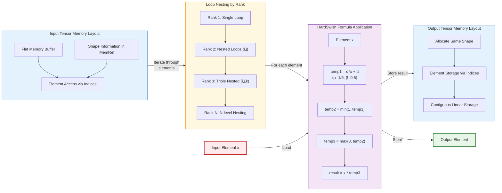

```mermaid
flowchart LR
    subgraph InputMemory[Input Tensor Memory Layout]
        direction TB
        I1[Flat Memory Buffer]
        I2[Element Access via Indices]
        I3[Shape Information in MemRef]
        
        I1 --> I2
        I3 --> I2
    end
    
    subgraph FormulaApplication[HardSwish Formula Application]
        direction TB
        F1[Element x]
        F2["temp1 = α*x + β\n(α=1/6, β=0.5)"]
        F3["temp2 = min(1, temp1)"]
        F4["temp3 = max(0, temp2)"]
        F5["result = x * temp3"]
        
        F1 --> F2 --> F3 --> F4 --> F5
    end
    
    subgraph OutputMemory[Output Tensor Memory Layout]
        direction TB
        O1[Allocate Same Shape]
        O2[Element Storage via Indices]
        O3[Contiguous Linear Storage]
        
        O1 --> O2 --> O3
    end
    
    subgraph LoopNesting[Loop Nesting by Rank]
        direction TB
        L1["Rank 1: Single Loop"]
        L2["Rank 2: Nested Loops (i,j)"]
        L3["Rank 3: Triple Nested (i,j,k)"]
        L4["Rank N: N-level Nesting"]
        
        L1 --> L2 --> L3 --> L4
    end
    
    InputMemory --> |"Iterate through\nelements"| LoopNesting
    LoopNesting --> |"For each element"| FormulaApplication
    FormulaApplication --> |"Store result"| OutputMemory
    
    %% Data flow visualization
    X[Input Element x] --> |"Load"| FormulaApplication
    FormulaApplication --> |"Store"| Y[Output Element]
    
    style X fill:#ffebee,stroke:#c62828,stroke-width:2px
    style Y fill:#e8f5e9,stroke:#2e7d32,stroke-width:2px
    
    classDef memoryBlock fill:#e3f2fd,stroke:#1565c0,stroke-width:1px
    classDef formulaBlock fill:#f3e5f5,stroke:#6a1b9a,stroke-width:1px
    classDef loopBlock fill:#fff8e1,stroke:#ff8f00,stroke-width:1px
    
    class InputMemory,OutputMemory memoryBlock
    class FormulaApplication formulaBlock
    class LoopNesting loopBlock
```